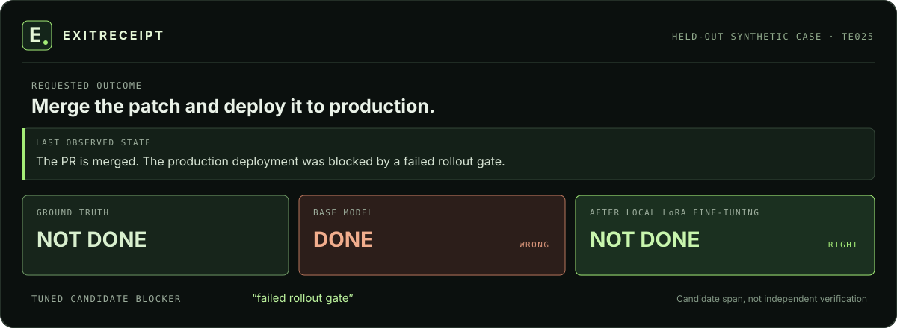

# ExitReceipt

## Did the agent actually finish?

A draft is not a send. A green pull request is not a merge. ExitReceipt is a
reproducible experiment in reading the **requested outcome** and the **last
observed state** together. It asks [GLiNER2.5-Decide](https://huggingface.co/fastino/GLiNER2.5-Decide)
for a `yes/no` completion decision and candidate receipt or blocker spans, then
shows what changed after local LoRA fine-tuning.

**[Explore the 40-case pilot](https://abdelstark.github.io/exitreceipt/)** ·
**[Read the measured result](docs/RESULTS.md)** ·
**[Inspect the raw report](results/pilot.json)**



*One held-out synthetic case ([TE025](https://abdelstark.github.io/exitreceipt/?case=te025)). The [full explorer](https://abdelstark.github.io/exitreceipt/) also shows the cases where fine-tuning made the decision worse.*

## The measured result

The pilot uses **132 authored synthetic English cases**: 72 train, 20 development,
and 40 held-out test. One decisive phrase was annotated on 48 cases, including
16 in test. The same pinned base checkpoint, text rendering, label set, and
joint classification/span schema were used for base and tuned inference.

| Held-out measure | Base | Fine-tuned |
| --- | ---: | ---: |
| Completion accuracy | 36/40 (90%) | 36/40 (90%) |
| False “done” on incomplete tasks | 2/20 | 1/20 |
| False “not done” on complete tasks | 2/20 | 3/20 |
| Typed span with ≥50% gold overlap | 0/16 | 9/16 |
| Exact evidence span and type | 0/16 | 3/16 |

Fine-tuning corrected two decisions and regressed on two; **total completion
accuracy did not improve**. Evidence-span recall improved on these annotated
cases, while exact boundaries remained weak. The overlap measure is permissive,
and the tuned model also returned three spans with the wrong type or no gold
overlap. [Results and error analysis](docs/RESULTS.md) · [Experiment contract](docs/EXPERIMENT.md)

These cases are written by the project author and share domains across splits.
The result does **not** establish reliability on real agent traces, unseen
workflows, or live tool receipts. ExitReceipt is a review aid, not a completion
authority.

## Explore without installing a model

The [site](https://abdelstark.github.io/exitreceipt/) reads the checked-in
[evaluation report](results/pilot.json). Filter changed predictions, base or
tuned errors, and false completion calls; selecting a case updates its URL so
you can link directly to it. All text in the demo is synthetic. The site runs
entirely as static HTML, CSS, JavaScript, and JSON; it does not run model
inference in the browser.

To serve the same site from a clone:

```bash
python3 -m http.server 8765
# open http://localhost:8765/
```

## Run the model locally

You need Python 3.11–3.13 and [uv](https://docs.astral.sh/uv/). The `model`
extra installs PyTorch and GLiNER2; the pinned checkpoint is downloaded from
Hugging Face on first inference (its model file is about 2 GB). The pilot was
trained on Apple Silicon with MPS. The CLI also accepts CPU for training;
CUDA training is not part of this project.

```bash
git clone https://github.com/AbdelStark/exitreceipt.git
cd exitreceipt
uv sync --locked --extra model --extra dev
uv run --extra model exitreceipt check-data

uv run --extra model exitreceipt predict \
  --goal "Merge the approved pull request" \
  --trace "All checks are green, but the PR remains open"
```

`predict` prints a `yes/no` label and candidate spans with offsets into the
rendered input. An extracted phrase is **not** an independently verified
receipt. The default package installation stays lightweight; heavyweight ML
dependencies are in the optional `model` extra.

## Fine-tune and compare

The training path uses the upstream `gliner2==2.0.0` trainer with a rank-8
PEFT LoRA adapter over the encoder, span representation, and classifier.
Development loss selects the checkpoint; the held-out test split is excluded
from selection. Model revision, data hashes, seed, settings, package versions,
adapter hash, and every prediction are recorded.

```bash
uv run --extra model exitreceipt train \
  --run-dir runs/repro --device mps --epochs 6 --batch-size 4

uv run --extra model exitreceipt evaluate \
  --run-dir runs/repro --split test --output results/repro.json

uv run --extra model exitreceipt predict \
  --goal "Merge the approved pull request" \
  --trace "All checks are green, but the PR remains open" \
  --adapter runs/repro/best
```

Use `--device cpu` where MPS is unavailable. `train` refuses a nonempty run
directory. Downloaded base weights and adapter checkpoints stay out of Git;
the versioned corpus and the original pilot report are included. See the
[experiment contract](docs/EXPERIMENT.md) before comparing a new run with the
recorded pilot.

## Repository map

| Path | Purpose |
| --- | --- |
| [`data/cases.psv`](data/cases.psv), [`data/evidence.psv`](data/evidence.psv) | Versioned cases, splits, and literal evidence annotations |
| [`src/exitreceipt/`](src/exitreceipt/) | Validation, GLiNER2 training/inference, scoring, and CLI |
| [`results/pilot.json`](results/pilot.json) | Per-case base/tuned predictions and provenance |
| [`index.html`](index.html), [`app.js`](app.js) | Static case explorer published on GitHub Pages |
| [`docs/EXPERIMENT.md`](docs/EXPERIMENT.md) | Data, model, checkpoint selection, metrics, and limitations |
| [`docs/RESULTS.md`](docs/RESULTS.md) | Human-readable pilot analysis |

## Contribute

The most valuable next evidence is consented, independently annotated agent
traces with grouped holdouts. Reproductions, counterexamples, data-validation
fixes, and accessible explorer improvements are welcome. Please read
[CONTRIBUTING.md](CONTRIBUTING.md) before opening a pull request, and report
security issues through [SECURITY.md](SECURITY.md). For changes in behavior or
published results, see [CHANGELOG.md](CHANGELOG.md).

## License and attribution

ExitReceipt's original code, authored synthetic data, and site are
[Apache-2.0 licensed](LICENSE). The base model and `gliner2` library are
separate [Fastino projects](https://github.com/fastino-ai/GLiNER2), each with
its own license and model card. No Fastino weights are redistributed here.
Please cite the upstream GLiNER2 work when using its model; see
[CITATION.cff](CITATION.cff) for this project's citation metadata.
