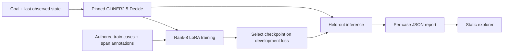

# Architecture

ExitReceipt has two independent surfaces: a local Python experiment and a
static report explorer. The website never loads a model or accepts a trace.

## Data and prediction path

`corpus.py` validates the two PSV files, split balance, unique IDs/text,
literal evidence phrases, and their agreement with completion labels. A case
is rendered as `Goal: ...\nLast observed state: ...` for both training and
inference. `model.py` constructs the same `finished: [yes, no]` classification
plus `receipt` and `blocker` entity schema for base and tuned calls. It rejects
unknown labels and spans whose offsets do not reproduce the source text.

`cli.py` coordinates training and evaluation. The upstream GLiNER2 trainer
chooses the best checkpoint by development loss. The adapter and metadata live
under ignored `runs/`; evaluation checks the saved data and model revision
before loading it. `metrics.py` scores the completion decision and
`evidence.py` scores typed candidate spans. The checked-in JSON preserves
every test case, prediction, candidate span, and relevant provenance.

## Website path

`index.html`, `style.css`, and `app.js` are served from the repository root by
GitHub Pages. The page fetches `results/pilot.json`, renders metrics from that
file, and uses text nodes for case content. The query parameters `case` and
`filter` make a view shareable. There is no backend or inference endpoint.

## Boundaries

- The corpus is synthetic and contains related workflow domains in every
  split; it does not measure transfer to live organizations or tool stacks.
- Candidate spans are model outputs, not independently authenticated receipts.
- The adapter is a local research artifact. Its binary hash is in the report,
  but the weights are not distributed; rerun training to obtain an adapter.
- A later comparison with another model needs the same examples, labels, and
  scoring contract. No such comparison is part of this pilot.
