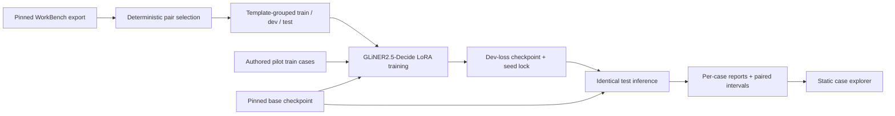

# Architecture

ExitReceipt has a local Python experiment and a static report explorer. The
website reads checked-in JSON and never runs model inference or receives a
trace from the visitor.

## Data and training

[`scripts/build_workbench_v2.py`](../scripts/build_workbench_v2.py) fetches an
exact WorkBench export revision, checks its SHA-256, selects one successful and
one failed 1–6-action run per eligible task, and assigns entire task-template
groups to splits. The source-row manifest records original model IDs, result
files, templates, scorer labels, and side-effect flags. V2 training appends the
72 original authored **train** cases and 24 span annotations; the older pilot
holdout is kept separate.

[`corpus.py`](../src/exitreceipt/corpus.py) validates the PSV fields, split
balance, unique IDs and exact texts, and literal evidence phrases. It accepts
a header-only evidence file for classification-only use cases. A case is
rendered as `Goal: ...\nLast observed state: ...` for both training and
inference. The WorkBench view makes the last line an ordered list of recorded
tool actions. Those actions do not contain tool returns or final state.

[`model.py`](../src/exitreceipt/model.py) loads the pinned
`fastino/GLiNER2.5-Decide` revision and uses the upstream `gliner2==2.0.0`
trainer for a rank-8 PEFT LoRA adapter. Base and tuned inference share the
`finished: [yes, no]` classification plus candidate `receipt` and `blocker`
span schema. Unknown labels and invalid span offsets fail closed.

## Evaluation and publication

The native trainer selects the lowest development-loss checkpoint within a
seed. [`scripts/select_v2_checkpoint.py`](../scripts/select_v2_checkpoint.py)
locks the seed with the lowest development loss and adapter hashes **before**
any test inference. The
[`v2-pretest-lock`](https://github.com/AbdelStark/exitreceipt/tree/v2-pretest-lock)
tag preserves that decision and the exact training lockfile. The
[`cli.py`](../src/exitreceipt/cli.py) evaluation path rejects data or base
revision mismatches, runs both models on the same test examples, and writes
all predictions, candidate spans, metrics, and source-row metadata.

[`scripts/summarize_v2.py`](../scripts/summarize_v2.py) checks all three reports
against the locked selection and identical base predictions. It computes
paired accuracy intervals by resampling held-out templates and, separately,
task pairs. [`scripts/publish_v2_model.py`](../scripts/publish_v2_model.py)
verifies every adapter hash against the reports before uploading the selected
and alternate seed weights, configs, training receipts, exact transformed
data, and card to the tagged Hugging Face release. Local checkpoints stay
under ignored `runs/`; the tagged adapters are public.

## Website and boundaries

`index.html`, `style.css`, and `app.js` are served from the repository root by
GitHub Pages. The v2 explorer fetches `results/v2-selected.json`; the pilot
toggle fetches `results/pilot.json`. It derives the scorecards from those
reports, puts case content in text nodes, and uses `case`, `filter`, and
`study` query parameters for shareable views. No backend or inference
endpoint exists.

WorkBench's `correct` label includes benchmark task correctness and can
penalize unwanted side effects; it is broader than the pilot's literal
requested-outcome label. The action-only input may lack enough information to
recover the sandbox verdict. Extracted spans are model candidates, not
independently authenticated receipts. The repository makes no claim about
live task verification, calibrated deployment risk, or a Jev comparison.
