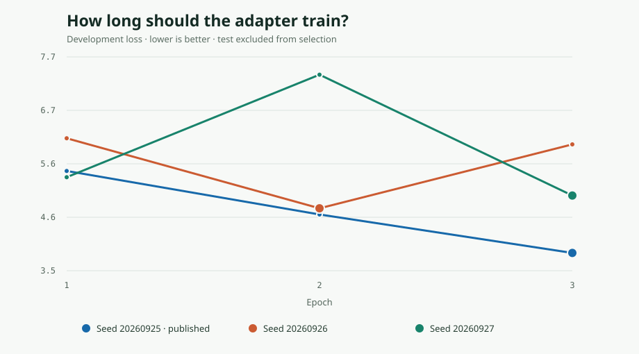

# V2 result: sandbox-scored agent actions

**Read this as a partial-observation benchmark.** The input contains a
WorkBench task and recorded tool actions. The target is WorkBench's sandbox
`correct` verdict, which can penalize unwanted side effects. Tool returns and
the final sandbox state are absent from the model input. This is broader than
the authored pilot's literal “did the requested outcome happen?” label.

The development-selected adapter improved from **87/158 to 96/158** correct
predictions, while false “done” calls fell from **58/79 to 34/79** failed runs.
It also missed more successful runs (**13/79 to 28/79**). The accuracy gain is
5.7 percentage points; its paired 95% interval grouped by the ten unseen task
templates is **−6.6 to +15.8 points**. The preregistered positive-headline
rule is **not met**. This is a directional result on a constructed benchmark,
not evidence that ExitReceipt reliably verifies arbitrary agent work.

## What was evaluated

The [pinned WorkBench export](../data/workbench-v2-manifest.json) contains
2026 agent runs scored against sandbox state. We selected one successful and
one failed eligible run for each of 590 tasks and held out entire
`base_template` groups by domain. The external rows are 838 train, 184
development, and 158 test examples. The training split also includes the
original pilot's 72 authored **train** examples and 24 literal span
annotations, for 910 training cases total. No pilot dev or test case was used
for v2 training or selection. The test has 79 task pairs from ten unseen
templates. It is balanced by construction, so its class proportions are not
an estimate of agent success rates.

The original WorkBench work is [MIT licensed](../data/WORKBENCH_LICENSE).
Its task instructions, action strings, source agent IDs, and verdict flags are
traceable through the [manifest](../data/workbench-v2-manifest.json), the
[derived cases](../data/v2-cases.psv), and the
[deterministic builder](../scripts/build_workbench_v2.py). The source export
commit and SHA-256 are recorded in the [experiment contract](V2_EXPERIMENT.md).

## Base, historical adapter, and three v2 seeds

All runs use the same pinned GLiNER2.5-Decide base revision, `finished: yes/no`
classification plus candidate span schema, input rendering, and test rows.
The v2 LoRA configuration is rank 8, dropout 0.1, batch size 4, and at most
three epochs. Each run retains its lowest-development-loss checkpoint.
Seed `20260925` was locked for publication from development loss
([pre-test tag](https://github.com/AbdelStark/exitreceipt/tree/v2-pretest-lock),
[selection receipt](../results/v2-selection.json)) before any test inference.

<!-- markdownlint-disable MD013 -->
| Model | Accuracy | False “done” / 79 failures | Missed “done” / 79 successes | Macro-F1 | Best dev loss |
| --- | ---: | ---: | ---: | ---: | ---: |
| Pinned base | 87/158 (55.1%) | 58 | 13 | 0.511 | — |
| V1 pilot adapter `v0.1.1` | 79/158 (50.0%) | 79 | 0 | 0.333 | Historical model |
| **V2 seed 20260925 · selected** | **96/158 (60.8%)** | **34** | **28** | **0.607** | **3.888** |
| V2 seed 20260926 | 100/158 (63.3%) | 26 | 32 | 0.632 | 4.766 |
| V2 seed 20260927 | 109/158 (69.0%) | 27 | 22 | 0.690 | 5.018 |
<!-- markdownlint-enable MD013 -->

The historical adapter said “yes” on every external row. It had been trained
on only 72 authored training cases; the v2 recipe also changes dropout and
data composition, so the v1-to-v2 difference cannot be attributed solely to
more examples. The v2 seeds all reduced false “done” calls, with a cost in
missed successful runs. The development-selected seed changed 51 verdicts:
30 corrections and 21 regressions.

The other seeds did better on this particular test. They were **not** selected
by the locked development rule. Their paired template-cluster accuracy-gain
intervals are −4.0 to +18.8 points (seed 26) and +0.6 to +25.7 points (seed
27). Seed 27's interval excludes zero, but promoting the best test seed to the
headline would be post-hoc selection across three candidates. The
[full robustness report](../results/v2-robustness.json) contains task-pair
intervals, every changed ID, and all metrics. The
[per-case reports](../results/v2-selected.json) expose the model outputs and
source-run metadata; the [historical comparison](../results/v2-v1-comparator.json)
contains every v1 prediction.

## Where the selected model helps and fails

<!-- markdownlint-disable MD013 -->
| Held-out domain | Cases | Base correct | Selected v2 correct |
| --- | ---: | ---: | ---: |
| Analytics | 22 | 9 | 12 |
| Calendar | 40 | 27 | 29 |
| CRM | 8 | 7 | 8 |
| Email | 20 | 13 | **7** |
| Multi-domain | 60 | 26 | 36 |
| Project management | 8 | 5 | 4 |
<!-- markdownlint-enable MD013 -->

The email regression is material. The adapter became more conservative, which
helped reject many failures but caused it to reject completed email tasks.
Among 46 failed test runs flagged by WorkBench for unwanted side effects,
false “done” fell from 44 to 29. Among 33 failures without that flag, it fell
from 14 to 5. Those slices are exploratory and small; they do not measure
real-world side-effect detection.

The [case explorer](https://abdelstark.github.io/exitreceipt/) lets you switch
between both runs of a paired task. For example, the selected adapter correctly
distinguishes a [calendar search without deletion](https://abdelstark.github.io/exitreceipt/?case=wb-calendar-001-no)
from the [run that called deletion](https://abdelstark.github.io/exitreceipt/?case=wb-calendar-001-yes).
It also illustrates a failure: on a
[bar-chart task with the requested start date](https://abdelstark.github.io/exitreceipt/?case=wb-analytics-002-yes),
the tuned model says “no”; it gives the same answer on the
[one-day-off run](https://abdelstark.github.io/exitreceipt/?case=wb-analytics-002-no).
The sandbox labels, action logs, and both predictions are visible in each
case. A recorded action is not a verified receipt.

## Did longer training help?

A development-only six-epoch run with seed `20260925` changed the linear
learning-rate schedule as well as the number of steps. Its best development
loss was **4.183 at epoch two**, worse than **3.888 at epoch three** under the
original three-epoch schedule. Its development loss rose to 6.381 by epoch
six. We reverted to the three-epoch recipe **before test inference** and kept
the six-epoch run out of model selection. This one-seed probe does not show
that all longer schedules are worse. See the
[length-probe receipt](../results/v2-length-probe.json) and the
[pre-test amendment](V2_EXPERIMENT.md#pre-test-training-length-amendments).

## Limits and next evidence

Ten held-out templates make the interval wide. The held-out tasks come from
the same WorkBench domains as training, not independent organizations or live
agent environments. Matching a logged action to a task can be impossible
without tool returns or the initial and final state. WorkBench `correct` can
also reject side effects even when a requested mutation happened. The v2 test
has no gold receipt/blocker spans, so candidate spans are shown but **not
scored as evidence quality**. No probability calibration, latency benchmark,
or live completion-authority claim follows from this study.

The next validation should use consented traces with the full tool result and
independently checked final state, with tasks and workflow families held out.
Until then, treat the adapter as an inspectable research artifact and keep
provider state as the source of truth.
